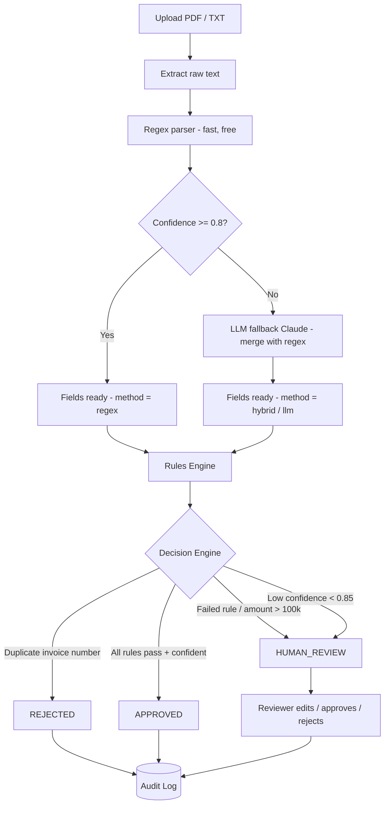
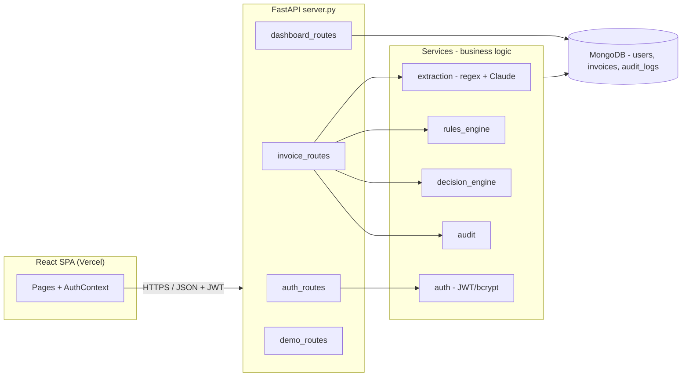

# Invoice.AI — Human-in-the-Loop Invoice Review

**AI-assisted invoice intake that auto-approves the easy cases, auto-rejects duplicates, and escalates everything risky to a human — with a full, immutable audit trail behind every decision.**

[](https://human-in-the-loop-eight.vercel.app)
&nbsp;
[](#)
[](#)
[](#)
[](#)

</div>

> **Demo logins** (seeded automatically): `admin@invoiceai.com` / `Admin@123` · `reviewer@invoiceai.com` / `Reviewer@123`

---

## 📸 Screenshots

| Dashboard | Upload & Decision |
|:---:|:---:|
|  |  |

| Review Queue | Invoice Detail & Audit Trail |
|:---:|:---:|
|  |  |

---

## The Problem

Finance teams receive thousands of invoices a day across many vendors. Manually checking each for completeness, duplicates, suspicious amounts, and policy violations is slow and error-prone. This system **automates the routine part** (extraction + validation) while keeping a human firmly in the loop on every ambiguous, high-value, or duplicate case — and records every action so an auditor can replay exactly how each decision was made.

---

## How It Works — The Decision Pipeline

The core of the system is what happens when an invoice is uploaded. The design goals are **cost-aware extraction** (don't call an LLM when a regex will do) and **never auto-approving a decision the machine isn't confident about**.



**The three terminal states**

| Status | Meaning | How it's reached |
|---|---|---|
| `APPROVED` | Auto-approved | All rules pass **and** extraction confidence >= 0.85 |
| `REJECTED` | Auto-rejected | Duplicate invoice number (or a reviewer rejects it) |
| `HUMAN_REVIEW` | Needs a person | Any failed rule, high-value amount, or low confidence |

---

## Architecture



**Layered by design.** Routes are thin (HTTP only); services hold the business logic; the rules and decision engines are **pure functions** (no DB, no HTTP) so they're trivially unit-testable and the business policy can evolve without touching the API layer.

---

## Key Features

- **Hybrid extraction** — deterministic regex parser first, Anthropic Claude fallback only when confidence is low; merges results and degrades gracefully if the LLM key is absent.
- **Rules engine** — missing fields, high-value (> 100,000), and duplicate-number checks, each producing a clear pass/fail with a reason.
- **Decision engine** — layers a confidence-score override on top of the rules: a rule-passing invoice with low extraction confidence is still routed to a human.
- **Human-in-the-loop console** — reviewers edit fields, then approve or reject; invoice-number uniqueness is re-validated on edit.
- **Immutable audit trail** — every step (upload → extract → rules → decision → human action) is logged with actor, timestamps, and notes.
- **Role-based auth** — JWT (httpOnly cookie + bearer), bcrypt-hashed passwords, `ADMIN` / `REVIEWER` roles, seeded on first startup.
- **Dashboard** — status breakdown, total amount processed, and average confidence via a MongoDB aggregation pipeline.
- **One-command Docker Compose** — MongoDB + backend + nginx-served frontend.

---

## Tech Stack

| Layer | Technology | Why |
|---|---|---|
| Frontend | React (CRA + CRACO), React Router, axios, Tailwind + shadcn/ui | Fast SPA, clean component system |
| Backend | FastAPI (async) | Modern, typed, auto OpenAPI docs |
| Database | MongoDB + Motor (async driver) | Document-shaped invoices, simple aggregations |
| Validation | Pydantic v2 | Typed request/response + DB models |
| Auth | PyJWT + bcrypt | Stateless tokens, salted password hashing |
| Extraction | pypdf + Anthropic Claude SDK | Text extraction + LLM fallback |
| Infra | Docker, docker-compose, nginx | Reproducible local + deploy |

---

## Project Structure

```
human-in-the-loop/
├── backend/
│   ├── server.py              # FastAPI app: routers, CORS, startup (indexes + seed)
│   ├── database.py            # Async Mongo client (Motor)
│   ├── models.py              # Pydantic models (users, invoices, audit_logs)
│   ├── routes/                # HTTP layer - thin
│   │   ├── auth_routes.py     # signup / login / logout / me + seeding
│   │   ├── invoice_routes.py  # process / list / get / edit / approve / reject / audit
│   │   ├── dashboard_routes.py# stats aggregation
│   │   └── demo_routes.py     # seeded sample data for the public demo
│   ├── services/              # business logic
│   │   ├── extraction.py      # regex + Claude hybrid extractor
│   │   ├── rules_engine.py    # pure validation rules
│   │   ├── decision_engine.py # final routing + confidence override
│   │   ├── audit.py           # append-only audit log
│   │   └── auth.py            # JWT, bcrypt, current-user dependency
│   ├── requirements.txt       # production deps
│   ├── requirements-dev.txt   # + pytest / black / isort / flake8 / mypy
│   └── Dockerfile
├── frontend/                  # React SPA (Vercel)
│   ├── src/pages/             # Login, Signup, Dashboard, Upload, Queue, InvoiceDetail, Demo
│   ├── src/components/        # AppShell, Sidebar, StatusBadge, AuditTimeline, ...
│   └── src/lib/               # api (axios), auth (context)
├── docker-compose.yml
└── docs/screenshots/          # README images
```

---

## Getting Started (local, without Docker)

**Prerequisites:** Python 3.11+, Node 18+ (with yarn), and MongoDB (or Docker for it).

```bash
# 1. Backend deps
cd backend
pip install -r requirements-dev.txt

# 2. Environment
cp .env.example .env
#   then edit: JWT_SECRET, MONGO_URL, DB_NAME, ANTHROPIC_API_KEY (optional)

# 3. MongoDB (if you don't have one running)
docker run -d -p 27017:27017 --name mongo mongo:7

# 4. Run the API  ->  http://localhost:8001  (docs at /docs)
uvicorn server:app --host 0.0.0.0 --port 8001 --reload

# 5. Frontend (new terminal)
cd ../frontend
yarn install
echo "REACT_APP_BACKEND_URL=http://localhost:8001" > .env
yarn start            # -> http://localhost:3000
```

Log in with the seeded admin: `admin@invoiceai.com` / `Admin@123`.

> **Note:** `ANTHROPIC_API_KEY` is optional. Without it, extraction falls back to the regex parser only — the app still works end to end.

---

## Getting Started (Docker)

```bash
docker compose up --build
```

Brings up MongoDB, the FastAPI backend (`:8001`), and the nginx-served frontend (`:3000`) with `/api` proxied to the backend.

---

## API Reference

All routes are prefixed with `/api`. Auth: send `Authorization: Bearer <token>` **or** rely on the `access_token` httpOnly cookie set at login.

| Method | Endpoint | Description | Auth |
|---|---|---|:---:|
| `POST` | `/signup` | Create account -> `{ access_token, user }` | – |
| `POST` | `/login` | Authenticate -> `{ access_token, user }` | – |
| `POST` | `/logout` | Clear session cookie | – |
| `GET` | `/auth/me` | Current user | ✓ |
| `POST` | `/process` | Upload (`multipart` `file`: .pdf/.txt) -> extract + decide | ✓ |
| `GET` | `/invoices` | List (`?status=&search=&sort=-created_at&limit=`) | ✓ |
| `GET` | `/invoice/{id}` | Get one invoice | ✓ |
| `PUT` | `/invoice/{id}` | Edit fields (re-checks duplicate) | ✓ |
| `POST` | `/approve/{id}` | Human approve | ✓ |
| `POST` | `/reject/{id}` | Human reject | ✓ |
| `GET` | `/audit/{id}` | Full audit trail for an invoice | ✓ |
| `GET` | `/stats` | Dashboard aggregates | ✓ |
| `GET` | `/health` | Health check | – |

Interactive docs are available at `/docs` (Swagger) when the backend is running.

---

## Data Model

Three MongoDB collections. Public IDs are application-generated **UUIDs** (non-guessable, portable), not Mongo `ObjectId`s. Models are deliberately kept relational-mappable for a future PostgreSQL migration.

<details>
<summary><b>users</b></summary>

| field | type | notes |
|---|---|---|
| id | string | UUID v4 |
| username | string | |
| email | string | unique, lowercased |
| password_hash | string | bcrypt |
| role | string | `ADMIN` \| `REVIEWER` |
| created_at | ISO date | |
</details>

<details>
<summary><b>invoices</b></summary>

| field | type | notes |
|---|---|---|
| id | string | UUID v4 |
| vendor / invoice_number / invoice_date / description | string? | extracted |
| amount | float? | extracted |
| status | string | `APPROVED` \| `REJECTED` \| `HUMAN_REVIEW` |
| confidence_score | float | 0–1 |
| decision_reason | string? | |
| passed_rules / failed_rules | string[] | |
| raw_text / filename | string? | |
| uploaded_by | string? | users.id |
| extraction_method | string | `regex` \| `hybrid` \| `llm` |
| created_at / updated_at | ISO date | |
</details>

<details>
<summary><b>audit_logs</b></summary>

| field | type | notes |
|---|---|---|
| id | string | UUID v4 |
| invoice_id | string | |
| action | string | e.g. `invoice_uploaded`, `approved_by_reviewer` |
| actor / actor_name | string? | user id/name or `system` |
| old_status / new_status | string? | |
| notes | string? | |
| created_at | ISO date | |
</details>

---

## Deployment

- **Frontend -> Vercel.** Auto-deploys from `main`. Set `REACT_APP_BACKEND_URL` to the live backend URL in the Vercel project settings.
- **Backend -> Render / Railway.** Deploy the `backend/` Dockerfile. Required env vars: `MONGO_URL`, `DB_NAME`, `JWT_SECRET`, plus optional `ANTHROPIC_API_KEY`, `ANTHROPIC_MODEL`, and `CORS_ORIGINS` (must include the Vercel URL).
- **Database -> MongoDB Atlas** (free tier works) for a managed `MONGO_URL`.

> CORS gotcha: the backend's `CORS_ORIGINS` must include your Vercel domain, or the deployed frontend won't be able to call the API.

---

## Testing

```bash
cd backend
pytest                 # API + engine tests
```

The rules and decision engines are pure functions, making them fast and deterministic to unit-test in isolation.

---

## Roadmap

- OCR for scanned/image-only invoices (Tesseract / cloud OCR)
- Structured-output mode + schema validation on LLM extraction
- Content-hash dedup to catch the same file re-uploaded under a new number
- Configurable rules/thresholds (move the 100k limit out of code)
- PostgreSQL + SQLAlchemy migration
- Analytics: cycle-time trends, vendor risk scoring, anomaly detection

---

<div align="center">
Built with FastAPI, React, and MongoDB.
</div>
